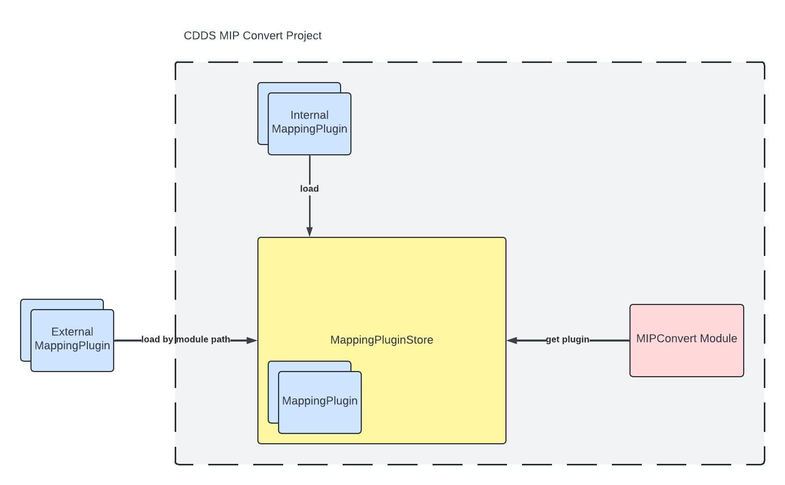

# Mapping Plugin Framework

## Overview

The plugin framework was designed using an object-oriented approach. This framework allows you to customise and extend 
MIP Convert. Plugins are loaded at runtime from a specific given path. A plugin is a bundle that adds functionality to 
MIP Convert such that MIP Convert can handle the mapping of specific models. This also allows third party developers to 
add functionality to MIP Convert without having access to the source code.

The Mapping plugin framework loads the specific plugin into a plugin store that stores it during runtime. This avoids excessive 
loading of the plugin. The MIP Convert code gets access to the plugin via the plugin store.

{ width="600" }
