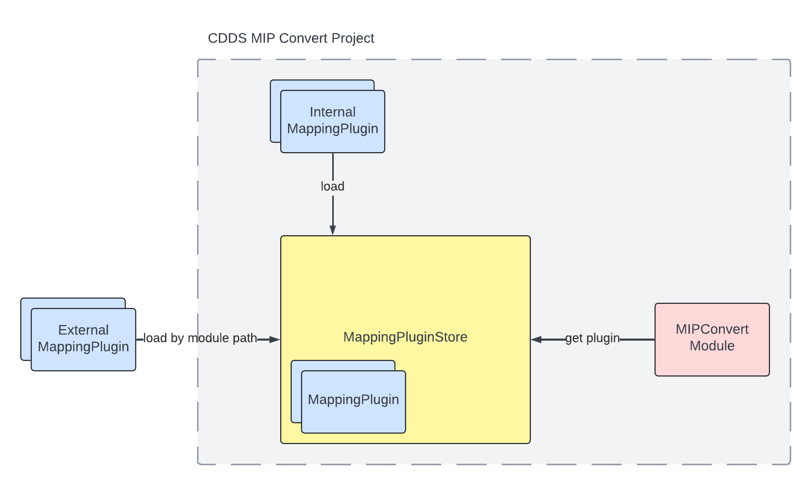
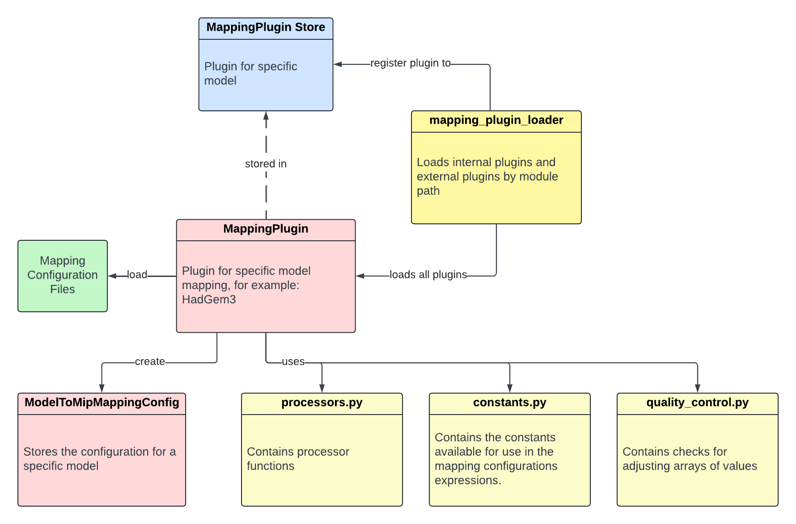
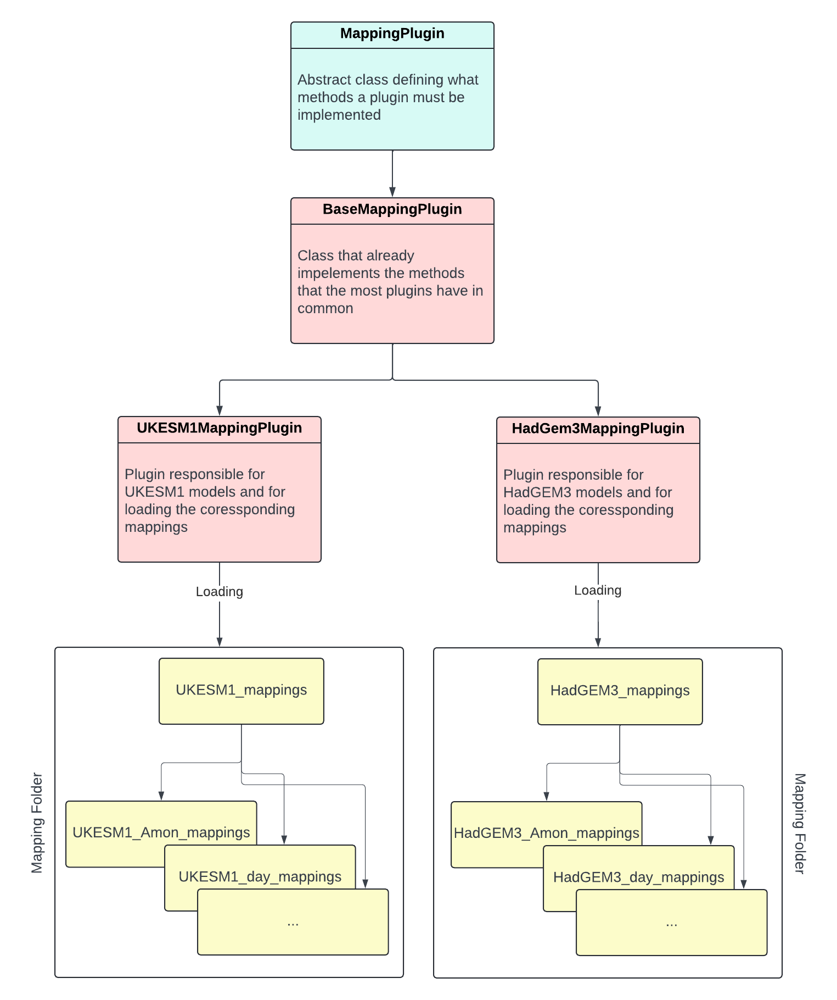

# Mapping Plugin Framework

## Overview

The mapping plugin framework was designed using an object-oriented approach. This framework allows you to customise and 
extend MipConvert. Mapping plugins are loaded at runtime from a specific given path. A mapping plugin is a bundle that 
adds functionality to MipConvert such that models (e.g. UKESM1 or HadGEM3) can be mapped for CMOR correctly. This also 
allows third party developers to add mapping functionality to MipConvert without having access to the source code. 

The mapping plugin framework loads the specific plugin into a plugin store that stores it during runtime. This avoids
excessive loading of the plugin. The MipConvert code gets access to the plugin via the plugin store.

{ width="900" }

## Mapping Plugin Structure
Like mentioned, a mapping plugin is a bundle that adds new functionality to MIP Convert. As a result MIp Convert can 
CMORise specific types of models.

A mapping plugin needs to provide all functionality to support these specific models. That especially includes information
about the mappings and processing functions for CMORisation the models.

The design of a plugin is illustrated in the below diagram:
{ width="900" }

The red boxes represent classes, the blue one a singleton class and the yellow ones modules. The green one represent all 
mapping configuration files.

A mapping plugin is loaded by the mapping plugin loader and registered to the mapping plugin store. The mapping plugin 
is stored and cached during runtime. Each mapping plugin contains information about the supported model family. 

The processors module containing all processing function that are needed to CMORise the models with the given mapping
configurations. The processing functions are different for each model family.

The constants module provides all the constants that can be used in the mapping configuration files.

The quality control modules contains the functionality how to check the data against min and max bounds. 

## A Single Mapping Plugin

There is an abstract mapping plugin class from which each mapping plugin must inherit. Each abstract function must be 
implemented of each mapping plugin.

The most mapping plugins can inherit from the base mapping plugin that is a child of the abstract mapping plugin. Most 
functionality are already implemented by the base mapping plugin except the method that returns the processing functions 
and the location of the mapping configuration files.

Each mapping plugin has a data folder containing all mapping configuration files and the module that contains the 
processing functions.

{ width="900" }


## Creating A New Mapping Plugin

### General

First, check if the models that should be supported are mostly covered by the functionality that are given by the base 
mapping plugin. If this is the case, the mapping plugin can be created by inherit from the `BaseMappingPlugin`, otherwise 
the mapping plugin must inherit from the `MappingPlugin`.

The folder and name conventions are in both case the same:

* Root folder for mapping plugin named by the model name in lower case (e.g. `ukesm1`) containing:
  * A `data` folder containing:
    * All mapping configuration files
    * All python modules that are necessary for the mapping plugin, like the `processors.py`.
  * The python module named `<model>_plugin.py` (e.g. `ukesm1_plugin.py`) containing:
    * The class `<model>MappingPlugin` that inherits from the `MappingPlugin` or `BaseMappingPlugin` and implements all
      necessary functions to support the corresponding model.

### Create Mapping Plugin Using Base Mapping Plugin

Following steps shows how to create a mapping plugin by using the `BaseMappingPlugin` as parent:

- [x] Create a root plugin folder with the name of the model in lower case (e.g. `ukesm1`).

- [x] Create a folder named `data` in the root plugin folder (e.g. `ukesm1/data`)

- [x] Add all the mapping configuration files into the `data` folder

- [x] Create a python module called `processors.py` in the `data` folder. This module should contain all processing functions 
      for CMORisation.

- [x] Create a python module called `<model>_plugin.py` (e.g. `ukesm1_plugin.py`) in the root plugin folder

- [x] In the `<model>_plugin.py`, implement the mapping plugin named `<model>MappingPlugin` and inherit from `BaseMappingPlugin`

- [x] In the `__init__` method, create the paths to the `data` directory containing the corresponding mapping configurations:
      ```python
      def __init__(self):
           data_dir = os.path.join(os.path.dirname(os.path.realpath(__file__)), 'data')
           super(<model>MappingPlugin, self).__init__('<model>', data_dir)

           self.input_variables: Dict[str, iris.cube.Cube] = {}
      ```
      where <model> is the name of the model that should be supported.

- [x] Import everything defined in `processors.py` by doing the wildcard `*`

- [x] Implement the `evaluate_expression`:
      ```python
      def evaluate_expression(self, expression: Any, input_variables: Dict[str, iris.cube.Cube]) -> iris.cube.Cube:
          self.input_variables = input_variables
          return eval(expression)
      ```

