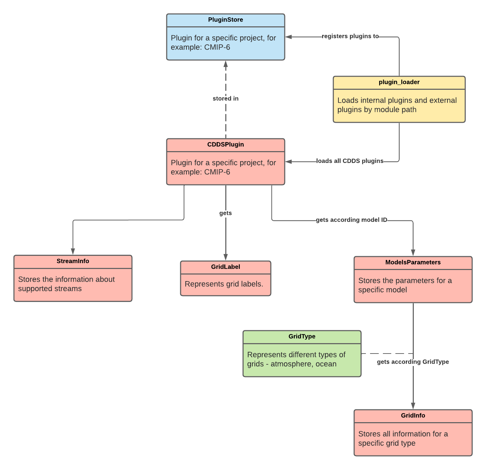

# Plugin Framework

## Overview

The plugin framework was designed using an object-oriented approach. This framework allows you to customise and extend CDDS. 
Plugins are loaded at runtime from a specific given path. A plugin is a bundle that adds functionality to CDDS such that 
CDDS can handle a specific model project (like CMIP6 or ARISE). This also allows third party developers to add functionality 
to CDDS without having access to the source code. 

The CDDS plugin framework loads the specific plugin into a plugin store that stores it during runtime. This avoids excessive 
loading of the plugin. The CDDS code gets access to the plugin via the plugin store.

{ width="600" }

The CMIP6 plugin will be loaded by default if no other plugin is given.

## Plugin

Like mentioned, a plugin is a bundle that adds new functionality to CDDS. As a result CDDS can handle a specific model project, 
also not CMIP6 projects.

A CDDS plugin needs to provide all functionality to handle that corresponding project. That includes information about the 
supported models, girds and streams.

The design of a plugin is illustrated in the below diagram:

{ width="600" }

The red boxes represent classes, the green ones enum classes and the yellow ones modules. The blue box represent a singleton 
class that has the functionality as a cache.

A plugin is loaded by the plugin loader and registered to the plugin store. The plugin store caches the plugin during runtime. 
Each plugin contains information about the supported models, streams and grid labels. The model parameters containing the 
model information also contains the information about the supported grid that are specified by the grid type (ocean or atmosphere).

## Available Plugins

| Name       | Supported Project   | Developer Team      |
|------------|---------------------|---------------------|
| CMIP6      | CMIP6 projects      | CDDS Team           |
| Cordex     | Cordex projects     | CDDS Team           |
| GCModelDev | GCModelDev projects | CDDS Team           |
| ARISE      | ARISE projects      | Matthew Mizielinski |
| SNAPSI     | SNAPSI projects     | Matthew Mizielinski |