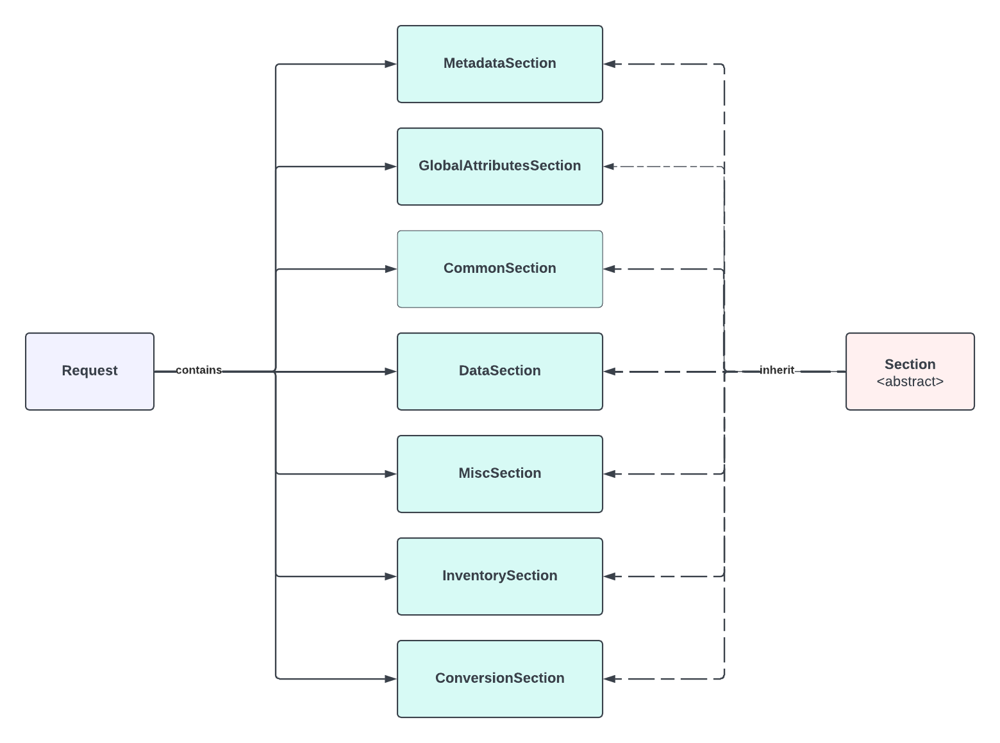
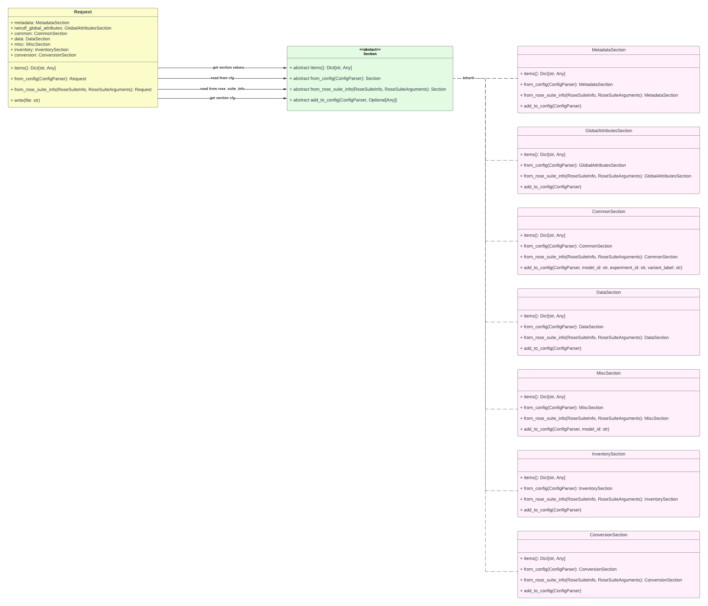
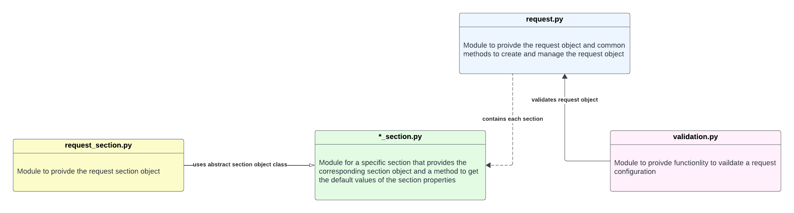

# Request Architecture

## Idea:
There is a request object that represents the corresponding request configuration file. Each section in the request
configuration file is represented by a request section object:

`Inheritance`
:   contains setting to load template for given request

`Metadata`
:   contains all metadata settings like the model ID or the MIP era

`Common `
:   contains common setting like the path to the root data folder or the path to the external plugin.

`Data`
:    contains all settings that are used to archive the data in MASS.

`Inventory`
:   contains all inventory settings.

`Conversion`
:   contains settings that specify how CDDS is run, e.g., skip any steps when running CDDS.

`Global Attributes`
:   contains all attributes that will be in the global attributes section of the CMOR file.

`Misc`
:   contains any settings that do not fit in any other section.

There is a class for each section that inherited from a abstract section class that force the implementation of all 
necessary functionalities.

{ width=600 }

The `Inheritance` section only contains a template that values should be loaded. The section is no own module. When 
reading the request configuration, it is checked if the request configuration contains an `Inheritance` section and 
a template should be loaded.

## Implementation:

### Classes
The request class represents the request configuration. It contains all methods and functionality to modify and 
manipulate the request configuration. The request class contains for each section a corresponding section object. A 
section class must inherit by the abstract section class that specifies the methods that should be provided to create 
and update a particular section. The section classes are implemented as data classes. Data classes are used to easily 
show the developer what settings can be set in the section. The following class diagram gives an idea of the 
implementation:

{ width=600 }

A request object can be created from a request configuration or from a `rose_suite.info`. Also, a section can be created 
from a request configuration or from a `rose_suite.info`. All settings items of a section can be asked for. The request 
object also provides a method to write the configuration into an output configuration file. To add all settings to this 
output configuration file, each settings object provides a method to add the settings to a configuration parser. An 
abstract section class is used to make sure that all section objects provide the necessary methods.

### Modules
There is a `request.py` module that contains the implementation of the request object and the methods to create and 
manipulate this object. The abstract section class is implemented in its own module `request_section.py`. This module 
also contains common methods for a specific section class. Each section class has its own module with `*_section.py` as 
name pattern (e.g. `common_section.py`). For validations of the request, a `validation.py` module is provided. Following 
diagram shows the modules and their dependencies:

{ width=600 }