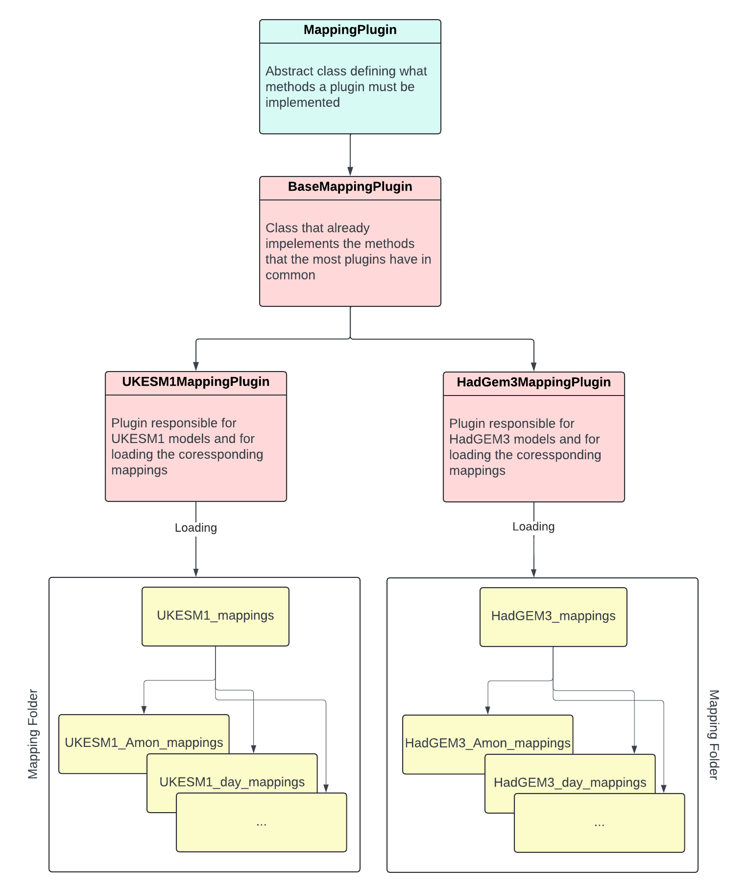

# How To Add A New Mapping Plugin

There is an abstract mapping plugin class from which each mapping plugin must inherit. Each abstract function must be 
implemented of each mapping plugin.

The most mapping plugins can inherit from the base mapping plugin that is a child of the abstract mapping plugin. Most 
functionality are already implemented by the base mapping plugin except the method that returns the processing functions 
and the location of the mapping configuration files.

Each mapping plugin has a data folder containing all mapping configuration files and the module that contains the 
processing functions.

{ width="900" }

### General

First, check if the models that should be supported are mostly covered by the functionality that are given by the base 
mapping plugin. If this is the case, the mapping plugin can be created by inherit from the `BaseMappingPlugin`, otherwise 
the mapping plugin must inherit from the `MappingPlugin`.

The folder and name conventions are in both case the same:

* Root folder for mapping plugin named by the model name in lower case (e.g. `ukesm1`) containing:
  * A `data` folder containing:
    * All mapping configuration files
    * All python modules that are necessary for the mapping plugin, like the `processors.py`.
  * The python module named `<model>_plugin.py` (e.g. `ukesm1_plugin.py`) containing:
    * The class `<model>MappingPlugin` that inherits from the `MappingPlugin` or `BaseMappingPlugin` and implements all
      necessary functions to support the corresponding model.

To create the folders and files structure, you can paste following content into a bash script file:
```bash
   #!/bin/bash
   
   MODEL="${@:1:1}"
   
   LOWER_MODEL=$(echo ${MODEL} | tr A-Z- a-z_)
   
   mkdir -p mip_convert/mip_convert/plugins/${LOWER_MODEL}
   mkdir -p mip_convert/mip_convert/plugins/${LOWER_MODEL}/data
   touch mip_convert/mip_convert/plugins/${LOWER_MODEL}/__init__.py
   touch mip_convert/mip_convert/plugins/${LOWER_MODEL}/${LOWER_MODEL}_plugin.py
   touch mip_convert/mip_convert/plugins/${LOWER_MODEL}/data/__init__.py
   touch mip_convert/mip_convert/plugins/${LOWER_MODEL}/data/processors.py
```

You can run the script file from your CDDS work directory by using following command:
```commandline
   sh <name_of_your_script_file> <model_name>
```

!!! example
    The script file name is `create_plugin_structure.sh` and the model you like to create the mapping plugin is `HadGEM2`. 
    Then, you must run following command:
    ```commandline
       sh create_plugin_structure.sh HadGEM2
    ```

### Create Mapping Plugin Using Base Mapping Plugin

Following steps shows how to create a mapping plugin by using the `BaseMappingPlugin` as parent:

- [x] Create a root plugin folder with the name of the model in lower case (e.g. `ukesm1`).

- [x] Create a folder named `data` in the root plugin folder (e.g. `ukesm1/data`)

- [x] Add all the mapping configuration files into the `data` folder

- [x] Create a python module called `processors.py` in the `data` folder. This module should contain all processing functions 
      for CMORisation.

- [x] Create a python module called `<model>_plugin.py` (e.g. `ukesm1_plugin.py`) in the root plugin folder

- [x] In the `<model>_plugin.py`, implement the mapping plugin named `<model>MappingPlugin` and inherit from `BaseMappingPlugin`

- [x] In the `__init__` method, create the paths to the `data` directory containing the corresponding mapping configurations:
      ```python
      def __init__(self):
           data_dir = os.path.join(os.path.dirname(os.path.realpath(__file__)), 'data')
           super(<model>MappingPlugin, self).__init__('<model>', data_dir)

           self.input_variables: Dict[str, iris.cube.Cube] = {}
      ```
      where <model> is the name of the model that should be supported.

- [x] Import everything defined in `processors.py` by doing the wildcard `*`

- [x] Implement the `evaluate_expression`:
      ```python
      def evaluate_expression(self, expression: Any, input_variables: Dict[str, iris.cube.Cube]) -> iris.cube.Cube:
          self.input_variables = input_variables
          return eval(expression)
      ```
